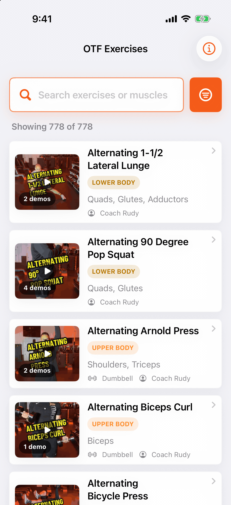
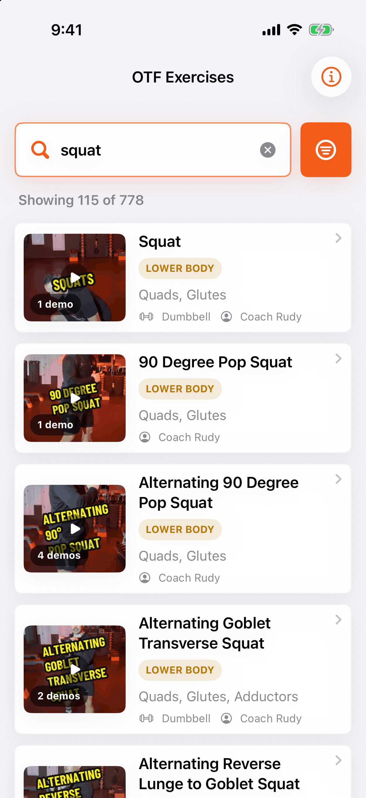

# OTF Exercises for iPhone (unofficial)

This is a native SwiftUI app for looking up an Orangetheory-style floor
exercise during class. You can search **778 exercises and 1,405 coach demo
videos** offline, filter by category, muscle, equipment, platform, or creator,
and open any demo on Instagram or TikTok. It is the iPhone companion to the
[OTF Exercise Directory](https://o-tf-exercises.vercel.app) web app
([source](https://github.com/vdoshi96/OTf-exercises)) and ships the same
reviewed catalog.

> **Unofficial fan directory — not affiliated with Orangetheory Fitness. Videos
> belong to their creators.** Orangetheory, OTF, and related marks belong to
> their respective owners.

| Directory | Search: "squat" | Exercise detail |
| --- | --- | --- |
|  |  |  |

## Features

- **Works offline.** The full catalog (JSON plus 1,405 thumbnails) ships in
  the app bundle, so it needs no network, account, or backend.
- **Instant local search.** Results are ranked by weighted matches on name,
  muscle groups, equipment, creator, and cues, and short typos still match
  (edit distance).
- **Filter sheet** for category, muscle group, equipment, platform, and
  creator. Active filters appear as removable chips.
- **Exercise detail** has a hero image, movement details, creators, and a
  video library. Each demo credits its creator and opens the original
  Instagram or TikTok post through the system.
- **Same catalog and conventions as the web app.** The default A–Z browse
  order, facet labels, and "Equipment not specified" wording all match the
  web.
- **About sheet** (the info button) with the disclaimer, catalog stats, and a
  link to the web directory.
- Dark mode, Dynamic Type, and VoiceOver labels on cards and controls.

## Architecture

```
OTFExercises/
├── OTFExercisesApp.swift           App entry
├── Models/Exercise.swift           Codable Exercise / ExerciseVideo / Creator, category + label helpers,
│                                   HTTPS allow-list for Instagram/TikTok links
├── Data/ExerciseRepository.swift   Async decode of the bundled JSON; ThumbnailResolver for /thumbs paths
├── Search/ExerciseSearchService.swift
│                                   Weighted local search, filtering, browse ordering (pure, unit-tested)
├── Views/                          Directory, card, detail, media, filter sheet, About + shared theme
└── Resources/                      exercises.json (778) + thumbs/ (1,405 JPEGs) + asset catalog
```

- **SwiftUI only**, iOS 17+, with `NavigationStack` value-based navigation and
  no web views.
- **Stateless by design.** The web app has no accounts or saved state, so the
  app keeps search and filter state in SwiftUI `@State` and has no
  persistence layer.
- **Search is a pure function** of `(exercises, query, filters)` in
  `ExerciseSearchService`. It fills a similar role to the web app's Fuse.js
  index but is written in plain Swift.
- **Safe outbound links.** Creator and video URLs must be HTTPS on
  instagram.com or tiktok.com, or the app won't open them.

More detail is in [ARCHITECTURE.md](ARCHITECTURE.md),
[DATA_MODEL.md](DATA_MODEL.md), and [MEDIA_HANDLING.md](MEDIA_HANDLING.md).

## Build and run

Requires Xcode 26 or newer and an iOS 17+ simulator or device.

1. Open `OTFExercises.xcodeproj`.
2. Select the `OTFExercises` scheme and an iPhone simulator.
3. Press Run. To run on a device, choose your team under Signing & Capabilities.

## Tests

```bash
xcodebuild test \
  -project OTFExercises.xcodeproj \
  -scheme OTFExercises \
  -destination 'platform=iOS Simulator,name=iPhone 17 Pro' \
  CODE_SIGNING_ALLOWED=NO
```

- **9 unit tests** cover catalog decoding and counts, thumbnail coverage for
  every video (including TikTok), facet labels, the URL allow-list,
  search relevance, combined filters, browse order, and empty results.
- **3 UI tests** cover directory and search, the filter-to-detail-to-media
  round trip, and the About disclaimer. A fourth, opt-in test
  (`testRecordedWalkthrough`, enabled with `TEST_RUNNER_OTF_WALKTHROUGH=1`)
  drives a paced walkthrough for screen recordings.

## Updating the catalog

The data is a snapshot of the web app's reviewed catalog. To refresh it:

1. Copy `src/data/exercises.json` from the web repo into `OTFExercises/Resources/`.
2. Copy every `/thumbs/*` file it references from the web repo's
   `public/thumbs/` into `OTFExercises/Resources/thumbs/`, and delete any that
   are no longer referenced.
3. Update the counts asserted in `ExerciseDataTests` and `OTFExercisesUITests`.

The current snapshot comes from web `main` at `4567fd5` (2026-09-23).

## Screenshots

Debug builds accept launch arguments that open specific screens, which makes
captures reproducible:

```bash
xcrun simctl launch booted com.vdoshi.OTFExercises -screenshotQuery squat
xcrun simctl launch booted com.vdoshi.OTFExercises -screenshotFilters YES
xcrun simctl launch booted com.vdoshi.OTFExercises -screenshotExercise goblet-squat
```
